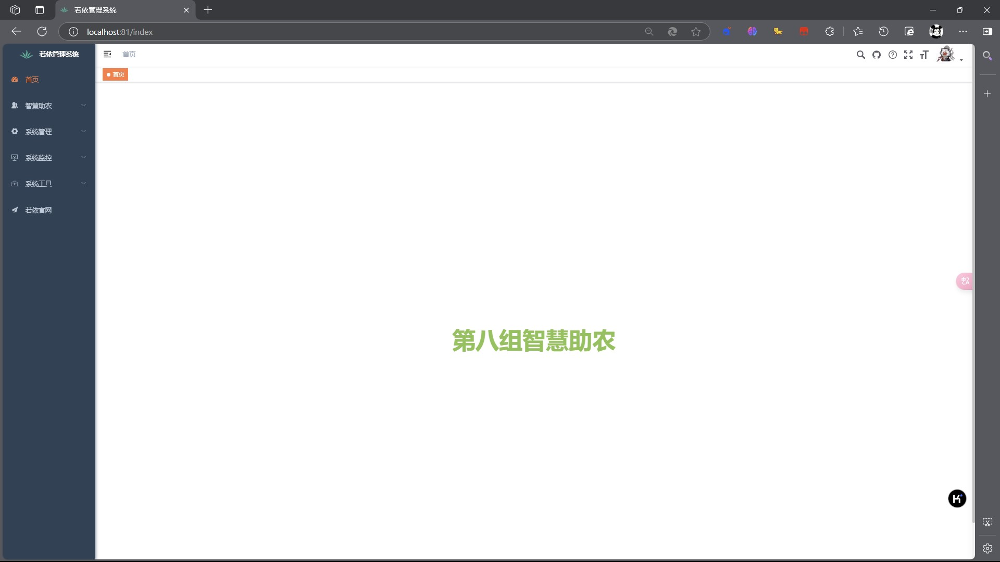
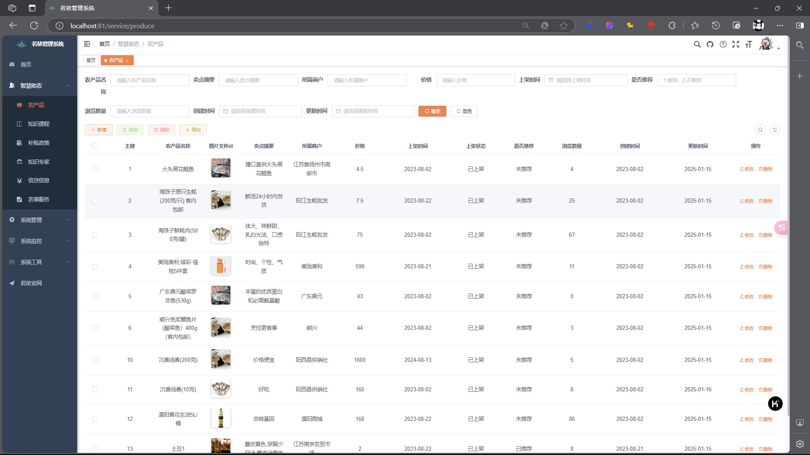
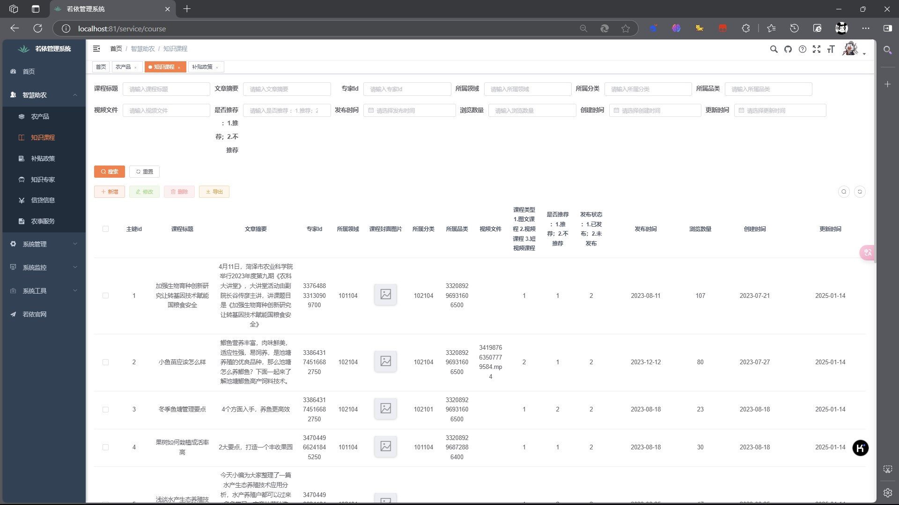
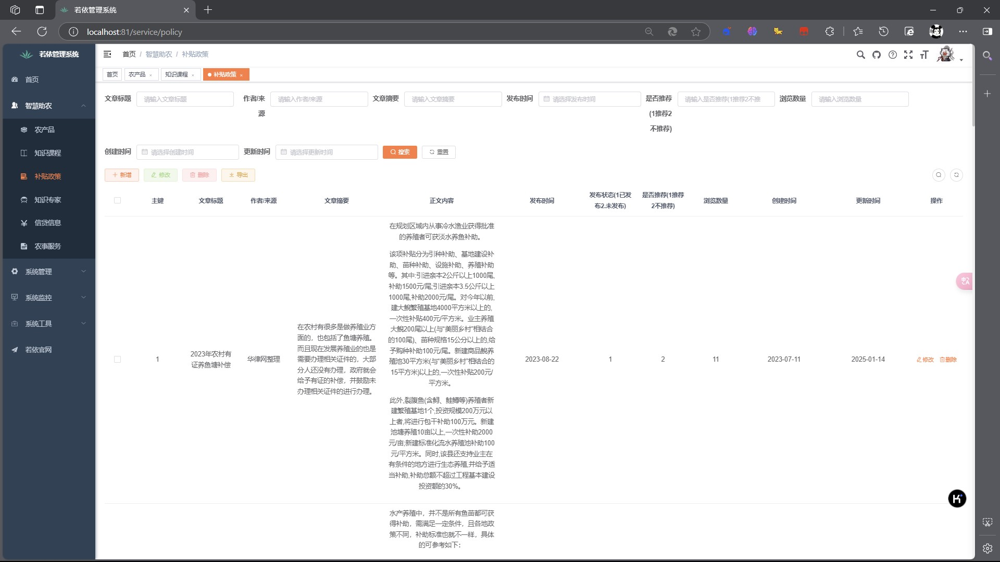
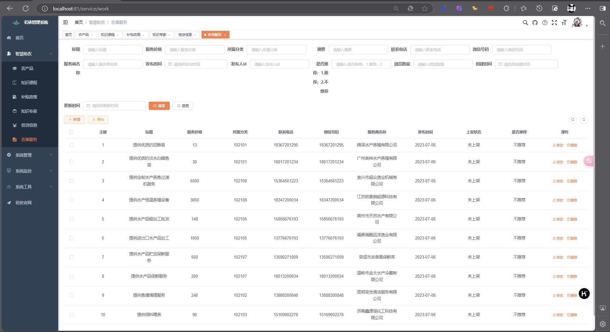
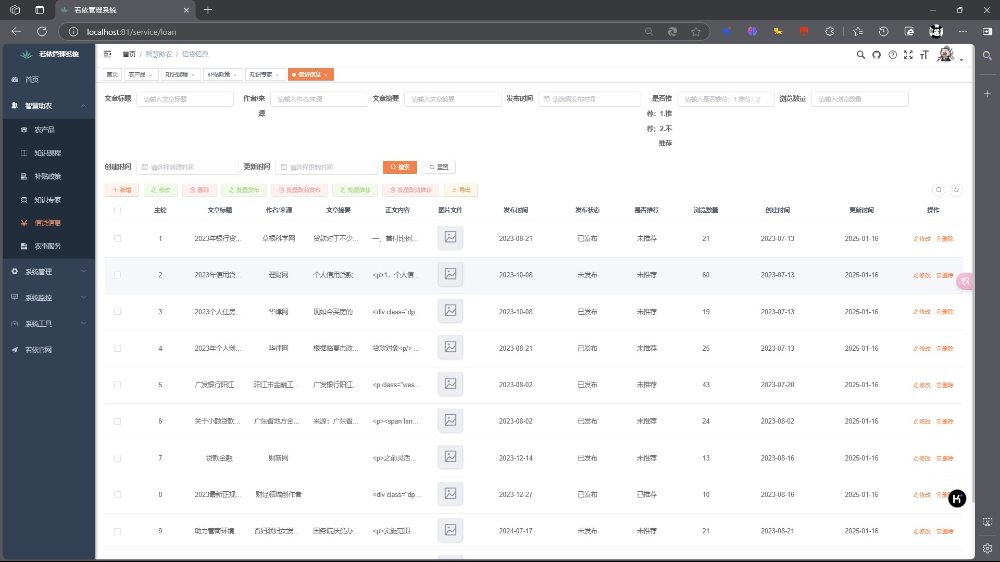
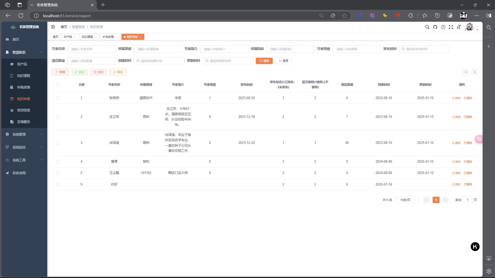

<p align="center">
	
</p>
<h1 align="center" style="margin: 30px 0 30px; font-weight: bold;">智慧助农 SmartAGl</h1>
<h4 align="center">基于若依 (RuoYi v3.8.9) 前后端分离框架的智慧农业综合服务平台</h4>
<p align="center">
	<a href="https://ruoyi.vip"></a>
	<a href="./LICENSE"></a>
	<a href="https://gitee.com/baizi-1/SmartAGl"></a>
</p>

## 项目简介

智慧助农（SmartAGl）是一个基于 [RuoYi-Vue](https://gitee.com/y_project/RuoYi-Vue) 前后端分离框架的智慧农业管理平台。平台面向农民和农业从业者，提供农产品信息管理、农业知识在线学习、惠农补贴政策查询、农事工作管理、农业专家咨询、信用贷款申请及农产品市场行情等一站式服务，助力农业数字化转型与乡村振兴。

## 系统截图

| 首页面板 | 农产品管理 |
|---------|-----------|
|  |  |

| 知识课程 | 补贴政策 |
|---------|---------|
|  |  |

| 农事工作 | 信用贷款 |
|---------|---------|
|  |  |

| 数据导出 |
|---------|
|  |

## 技术栈

| 层级 | 技术 | 版本 |
|------|------|------|
| 后端框架 | Spring Boot | 2.5.15 |
| 安全框架 | Spring Security | 5.7.12 |
| 前端框架 | Vue 2 + Element UI | — |
| 数据库 | MySQL | — |
| 连接池 | Druid | 1.2.23 |
| 接口文档 | Swagger 3 / Knife4j | 3.0.0 |
| 定时任务 | Quartz | — |
| 缓存 | Redis | — |
| 认证 | JWT | 0.9.1 |
| 构建工具 | Maven | — |
| Java 版本 | JDK | 1.8 |

## 项目结构

```
SmartAGl/
├── ruoyi-admin          # 管理后台 - 应用启动入口
├── ruoyi-common         # 通用模块 - 工具类、注解、异常处理
├── ruoyi-framework      # 框架模块 - 核心配置、安全、拦截器
├── ruoyi-system         # 系统模块 - 用户、角色、菜单、部门管理
├── ruoyi-quartz         # 定时任务模块
├── ruoyi-generator      # 代码生成模块
├── ruoyi-zhunong        # 智慧助农业务模块 ★
│   ├── controller/      #   农产品/课程/政策/工作/专家/贷款/市场
│   ├── domain/          #   实体类
│   ├── mapper/          #   数据访问层
│   └── service/         #   业务逻辑层
├── ruoyi-ui             # 前端 UI (Vue 2 + Element UI)
├── sql/                 # 数据库初始化脚本
├── doc/                 # 项目文档
├── Image/               # README 截图素材
└── pom.xml              # Maven 父 POM
```

## 内置功能

### 一、系统基础功能（若依框架）

| 序号 | 功能 | 说明 |
|------|------|------|
| 1 | 用户管理 | 系统用户配置与管理 |
| 2 | 部门管理 | 组织机构配置（公司、部门、小组），树结构展现 |
| 3 | 岗位管理 | 用户职务配置 |
| 4 | 菜单管理 | 系统菜单、操作权限、按钮权限配置 |
| 5 | 角色管理 | 角色权限分配、数据范围权限划分 |
| 6 | 字典管理 | 系统常用固定数据维护 |
| 7 | 参数管理 | 系统动态参数配置 |
| 8 | 通知公告 | 系统通知公告发布与维护 |
| 9 | 操作日志 | 操作日志记录与查询 |
| 10 | 登录日志 | 登录日志记录与异常查询 |
| 11 | 在线用户 | 活跃用户状态监控 |
| 12 | 定时任务 | 在线任务调度管理，支持执行结果日志 |
| 13 | 代码生成 | 前后端代码自动生成（Java、HTML、XML、SQL），支持 CRUD 下载 |
| 14 | 系统接口 | API 接口文档自动生成 |
| 15 | 服务监控 | CPU、内存、磁盘、堆栈等系统信息监控 |
| 16 | 缓存监控 | Redis 缓存信息查询与命令统计 |
| 17 | 在线构建器 | 拖动表单元素生成 HTML 代码 |
| 18 | 连接池监视 | 数据库连接池状态监控与 SQL 分析 |

### 二、智慧农业新增功能

| 序号 | 模块 | 功能说明 |
|------|------|----------|
| 1 | 🍎 **农产品管理** | 查看和管理农产品信息，支持增删改查与分类检索 |
| 2 | 📚 **知识课程** | 农业技术知识课程在线浏览与管理，助力技能提升 |
| 3 | 📋 **补贴政策** | 汇集惠农补贴政策信息，支持分类查询与管理 |
| 4 | 🌾 **农事工作** | 农事活动记录与管理，包括播种、施肥、收割等全流程 |
| 5 | 👨‍🌾 **知识专家** | 农业专家信息管理，在线获取专业技术指导 |
| 6 | 💰 **信用贷款** | 农业信用贷款产品查询与申请管理 |
| 7 | 🏪 **农产品市场** | 农产品市场行情展示，供需信息发布与管理 |

## 快速开始

### 环境要求

- JDK >= 1.8
- Maven >= 3.6
- MySQL >= 5.7
- Redis >= 3.0
- Node.js >= 12

### 后端部署

```bash
# 1. 克隆项目
git clone https://gitee.com/baizi-1/SmartAGl.git
cd SmartAGl

# 2. 导入数据库
# 在 MySQL 中执行 sql/ry_20240629.sql 和 sql/quartz.sql
# 再依次执行 courseMenu.sql、expertMenu.sql、policyMenu.sql、workMenu.sql、nb_credit_loan.sql

# 3. 修改数据库配置
# 编辑 ruoyi-admin/src/main/resources/application-druid.yml
# 修改数据库连接地址、用户名和密码

# 4. 修改 Redis 配置
# 编辑 ruoyi-admin/src/main/resources/application.yml
# 修改 Redis 连接信息（如有密码）

# 5. 编译运行
mvn clean install
cd ruoyi-admin
mvn spring-boot:run

# 或者直接运行启动脚本
ry.bat    # Windows
sh ry.sh  # Linux / macOS
```

### 前端部署

```bash
# 进入前端目录
cd ruoyi-ui

# 安装依赖
npm install --registry=https://registry.npmmirror.com

# 启动开发服务器
npm run dev

# 浏览器访问 http://localhost:80 进入系统
```

### 默认账号

- 管理员账号：`admin` / 密码：`admin123`
- 普通用户账号：`ry` / 密码：`admin123`

## 相关链接

- 若依框架官方：https://ruoyi.vip
- 若依 Vue 前端：https://gitee.com/y_project/RuoYi-Vue
- 本项目仓库：https://gitee.com/baizi-1/SmartAGl

## 许可证

本项目基于 [MIT License](./LICENSE) 开源。


